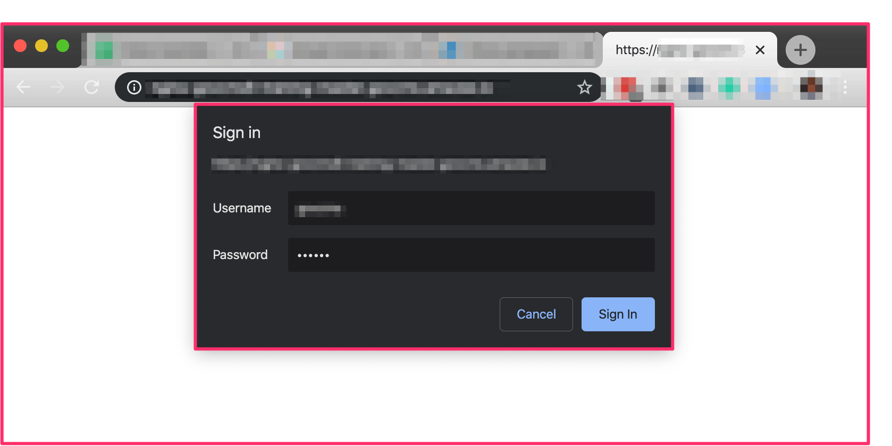

# How to login to GovCMS



To get to the login screen of most GovCMS sites, simply type the site’s URL with **/user** on the end. \(For many government sites this won't work unless you’re on the internal network.\) For example:

* [https://www.salsadigital.com.au/](https://www.salsadigital.com.au/user)[**user**](https://www.salsadigital.com.au/user)
* [http://govcms.gov.au/](http://govcms.gov.au/user)[**user**](http://govcms.gov.au/user)

If your training environment is hosted in the GovCMS cluster \(hosted by Amazee.io\), it’s protected against public access by _Shield_ authentication, which means you’ll see a popup window with the username and password fields.

For this training course, every trainee is provided with an individual environment. To separate environments, we preconfigured individual URLs per environment. Each trainee should use their _Individual Environment ID_. Refer to the slide \(or the whiteboard\) for the environment URL.

Navigate to the training environment URL displayed in the slide or whiteboard and type the following username and password into the authentication popup – this is to access the site.

Username: refer to the whiteboard

Password: refer to the whiteboard

#### Exercise 1.1: Login to your training site as administrator

To login to the administrative interface, add **/user** to the end of the link you’ve been given by your trainer. This should bring you to the login page. Notice how although the style and layout of this page is different from the homepage, the “header” and “footer” sections are still the same:

Refer to the whiteboard for the login credentials

**Tip:** If you’ve navigated away from the homepage, the link on your browser may differ from the one provided. To get back to the homepage, you can click on the “GovCMS” logo at the top left of the page, or use the “Home” link in the main navigation menu.

After you’ve successfully logged in as an administrator, you’ll be redirected to a page that has your username as the page ‘title’ \(1\), and also shows you a green confirmation message with information about the last time you logged in \(2\):

**Note:** that some elements from the screenshot below may be different, due to permissions settings.

Notice the black band running across the top of the page \(3\). This is called the “Admin menu”, and is an indication that you’re currently logged into the site \(as opposed to simply visiting it as an “anonymous” user\). At the top-right of the “Admin toolbar”, you can see the username of the account you’re currently logged in with \(4\).

**Tip:** You might see or hear the Admin menu also referred to as “Administration”, “Admin bar”, “Admin toolbar”, “Navbar”, or simply “Toolbar”.

Next, use either the “GovCMS” logo, or the “Home” menu link to go back to the homepage. You’ll notice that the Admin menu is still there. The Admin menu helps people who have logged into the site \(such as site admins, content authors/reviewers, etc.\) to navigate faster through the various pages of the admin interface. Once logged in, it’s available in the frontend and backend of your GovCMS site.

**Tip:** As mentioned earlier, the regular pages that contain the actual content your site visitors see \(blog/article text, images, etc.\), is often referred to as the “frontend”, while the Admin interface may be referred to as the “backend”.

