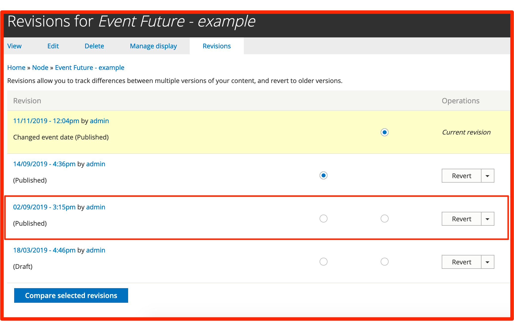

# Managing content revisions

GovCMS creates a new revision every time a content page is updated. This allows you to track how the content has changed over time on your site, with a new revision created every time the page is saved.

To view and manage revisions, use the Revisions tab.

**Note**: Depending on your website configuration, not every user role can access the Revisions tab.

From the Revisions tab, you can view the individual revisions, revert to an earlier revision, and delete revisions.

In the Revisions tab, a table lists each revision along with a timestamp, the user who made the change, and the revision log message, if entered. You can also see the differences between two revisions.

When you revert to a previous revision, GovCMS creates a copy. So if you have three revision versions \(eg, 1,2,3 and current, when you revert to \#2 a copy of \#2 is made and the copy is set as the current revision. So after the reversion, you’ll end up with five versions/revisions \(1,2,3,4 and current\), where current is a clone of \#2.

Another useful feature of the revision system is the _Revision log message_ field, which appears near the _Create a new revision_ checkbox on the content editing form. If you add a message to this field when you create a revision, that message will appear on the Revisions tab along with the revision. It’s a good idea to add a meaningful message here whenever you create a node revision so that others \(or you, months later\) can see why you changed the node and what your changes were, without having to actually view the previous revision.

## Exercise 4.1: View Revisions History

In this exercise you’ll learn how to view your revision history for a piece of content. You can also revert content to previous versions from the Revisions History page. Follow these steps to find your change history for the test Standard Page we’ve been working on:

1. Go to the Content Administration page and find the page you edited in the previous exercise
2. Click the title link to access the page \(you can also get to the page you edited by entering its URL into your web browser\)
3. Click the **Revisions** tab \(see screenshot below for an example\)

**Tip:** When saving content changes it’s a good idea to leave a short but descriptive _Revision log message_. This can help you and other _Content Editors_ understand what changes were made in each revision \(which is particularly handy if you need to revert to an older version\).

## Exercise 4.2: Revert a content Revision

In this exercise you’ll learn how to revert to a previous version of your content.

1. Go to the Content Administration page and find the page you were editing in the previous exercises.
2. Click the title link to get to the page \(you can also access the page by entering its URL into your web browser or accessing it via the frontend\)
3. Click the **Revisions** tab
4. Locate the version before the current one and use the Revert button
5. Review the Revisions page, do you see a new revision created? You may discuss it with the trainer.
6. Navigate to the public view of the page \(e.g. using an Incognito/Private mode in your browser\) and confirm if the content has been reverted.

**Note**: Only a previously Published revision can become the Current one. Draft revision \#1 \(from the example below\) will create a new draft revision \#5 and the current published revision \#4 will stay as Current.

**Note**: Only a previously Published revision can become the Current one. Draft revision \#1 \(from the example below\) will create a new draft revision \#5 and the current published revision \#4 will stay as Current.

