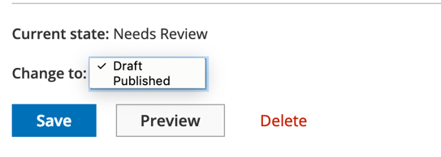

# Content moderation in GovCMS



A content moderation workflow allows content to go through an approval process before it’s posted live on a website.

GovCMS comes with a default workflow process \(see the diagram below\). In this model:

* Content has four "states"
* Content “transitions” as it moves from one state to another
* Different people/roles have different permissions when it comes to the content workflow. For example, in the default setting, Content Editors _cannot publish content -_ it has to be approved by a Content Approver.

This default workflow can also be extended by a site builder/developer.

### Changing the content moderation state

You can publish content using the content editing form. The "states" available will correspond to the current content state, as well as the transitions you’re permitted to use within your official content role.

### Content moderation

Content moderation is a GovCMS tool \(module\) that provides the publishing workflow functionality. It also provides a customisable dashboard. You can access it from the main Content Administration page by clicking the **Moderated content** tab \(position 2 in the figure below\).

_Moderated content page in GovCMS_

#### Exercise 5.1: Use the Content Moderation

This exercise will demonstrate how content can be moved through the _Content Moderation_ statuses.

1. In the NavBar, click on **Content**, then click the secondary tab **Moderated Content**
2. Select a content item in the list that requires moderation and click **Edit**
3. Make some changes to the content \(e.g. delete some text or add text\)
4. Save the content, leaving it in the Draft status \(notice that you’re redirected to the _Moderated Content_ page and that the content page you were just editing is now at the top of the list\)
5. Select the content item you just edited and click **Edit** again
6. Click _Change to:_ “Needs Review" and press **Save**
7. Edit the same content item again
8. Click _Change to:_ “Published" and press **Save**

Moving content through the workflow process from Draft to Published usually involves multiple people. However, if your account has full permissions, you can move content through the states and publish changes immediately.

## 

