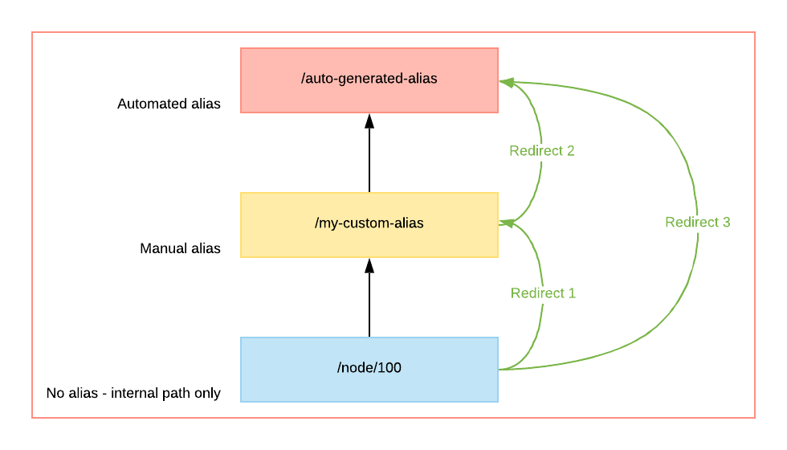

# About redirects

URL aliases are generally the best URL for site visitors to use. However, sometimes you may need an alternative URL. This may be because an incorrect URL was published in print or on another website or because you want to create a shorter URL for a marketing campaign.

Redirects are also created by GovCMS to make sure only one \(usually the latest\) URL alias is functional and to ensure previously created URL aliases do not return “404 Not Found” response.

  
_Illustration of how Redirects are forwarding all traffic to the latest Alias_

**Tip:** Redirects are generally a better option because extra URL aliases can mean you end up with duplicate content issues, which has a negative impact on SEO.

#### Advanced Exercise 7.3: Create a Redirect

In this exercise you’ll learn how to create a redirect.

**Note**: Managing redirects on the site requires “privileged” role access, such as an Administrator. Although you have Administrator access for the training site, this may not be provided for your GovCMS website.

In this exercise we’ll create a fully custom redirect from a short URL to a page of your preference.

1. In the _Administration Menu_, go to _Configuration_ → _Search and metadata_ → _URL Redirects_
2. Click the **Add Redirect** button
3. Enter _Path_ with your preferred redirect URL. This is the URL where your page, selected in the next step, will be redirected from. This should not be an existing alias or content URL in your site.
4. In the “To” field, type the title \(or part of the title\) of the page that you need to be redirected to. This autoselect field will locate the page, using your input. Select the page you want to redirect by clicking it.

   

   You can redirect to an external URL, by entering a full URL in the “To” field - for example, [https://salsadigital.com.au/](https://salsadigital.com.au/) \(make sure you enter the schema, such as https://, or the redirect won’t function\).

5. Press the **Save** button.

   

6. Test your new redirect by going to the _Path_ you provided in step 3 and confirming that the page you selected in the _To_ field is displayed. What’s the page URL now? 
7. In small groups, discuss how you could use the _URL Redirects_ functionality in GovCMS for your government agency website.

## 

